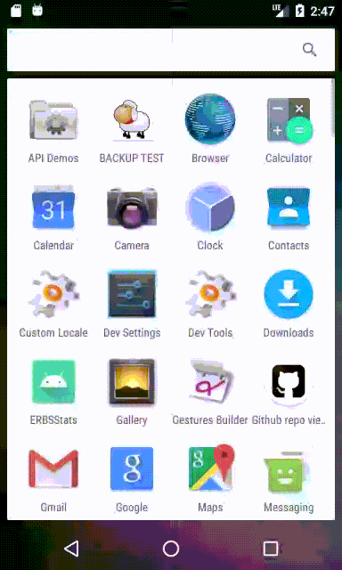

# GithubRepoViewer

Это android приложение, которое показывает публичные репозитории GitHub  

### Функции  

-	Может показывать список репозиториев  
-	Может показывать web страницу репозитория  
-	Может делится ссылкой на репозиторий  

### Архитектура

MVVM, Single-Activity

### Инструменты
- Kotlin – предпочтительный язык разработки под android
- Kotlin сoroutines - асинхронный код
- ViewModel - хранение и управление данными фрагментов
- Google Navigation Component - навигация между фрагментами
- Glide – загрузка изображений
- ViewBinding - замена findViewById
- Retrofit2 - http запросы
- GSON - работа с json файлами
- LiveData - взаимодействие фрагмента и viewModel
- RecyclerView – отображение динамических списков
- Dagger2 - реализация внедрения зависимостей
- WebView – отображение web-страницы
- Jetpack paging 3 – пагинация
